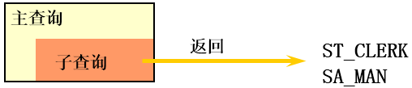
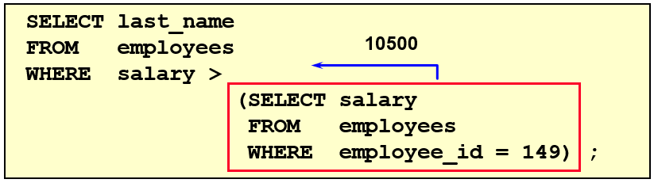
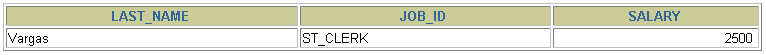
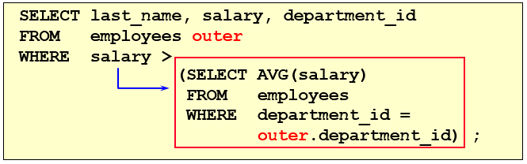

# 第09章_子查询

讲师：尚硅谷-宋红康（江湖人称：康师傅）

官网：[http://www.atguigu.com](http://www.atguigu.com/)

***

子查询指一个查询语句嵌套在另一个查询语句内部的查询，这个特性从MySQL 4.1开始引入。

SQL 中子查询的使用大大增强了 SELECT 查询的能力，因为很多时候查询需要从结果集中获取数据，或者需要从同一个表中先计算得出一个数据结果，然后与这个数据结果（可能是某个标量，也可能是某个集合）进行比较。

## 1. 需求分析与问题解决

### 1.1 实际问题


现有解决方式：

```mysql
#方式一：
SELECT salary
FROM employees
WHERE last_name = 'Abel';

SELECT last_name,salary
FROM employees
WHERE salary > 11000;

#方式二：自连接
SELECT e2.last_name,e2.salary
FROM employees e1,employees e2
WHERE e1.last_name = 'Abel'
AND e1.`salary` < e2.`salary`
```

```mysql
#方式三：子查询
SELECT last_name,salary
FROM employees
WHERE salary > (
		SELECT salary
		FROM employees
		WHERE last_name = 'Abel'
		);
```

 

### 1.2 子查询的基本使用

- 子查询的基本语法结构：

 

- 子查询（内查询）在主查询之前一次执行完成。
- 子查询的结果被主查询（外查询）使用 。
- **注意事项**
  - 子查询要包含在括号内
  - 将子查询放在比较条件的右侧
  - 单行操作符对应单行子查询，多行操作符对应多行子查询

### 1.3 子查询的分类

**分类方式1：**

我们按内查询的结果返回一条还是多条记录，将子查询分为`单行子查询`、`多行子查询`。

- 单行子查询

  

- 多行子查询



**分类方式2：**

我们按内查询是否被执行多次，将子查询划分为`相关(或关联)子查询`和`不相关(或非关联)子查询`。

子查询从数据表中查询了数据结果，如果这个数据结果只执行一次，然后这个数据结果作为主查询的条件进行执行，那么这样的子查询叫做不相关子查询。

同样，如果子查询需要执行多次，即采用循环的方式，先从外部查询开始，每次都传入子查询进行查询，然后再将结果反馈给外部，这种嵌套的执行方式就称为相关子查询。

## 2. 单行子查询

### 2.1 单行比较操作符

| 操作符 | 含义                     |
| ------ | ------------------------ |
| =      | equal to                 |
| >      | greater than             |
| >=     | greater than or equal to |
| <      | less than                |
| <=     | less than or equal to    |
| <>     | not equal to             |

### 2.2 代码示例

**题目：查询工资大于149号员工工资的员工的信息**

 

 

**题目：返回job_id与141号员工相同，salary比143号员工多的员工姓名，job_id和工资**

```sql
SELECT last_name, job_id, salary
FROM   employees
WHERE  job_id =  
                (SELECT job_id
                 FROM   employees
                 WHERE  employee_id = 141)
AND    salary >
                (SELECT salary
                 FROM   employees
                 WHERE  employee_id = 143);
```


**题目：返回公司工资最少的员工的last_name,job_id和salary**

```sql
SELECT last_name, job_id, salary
FROM   employees
WHERE  salary = 
                (SELECT MIN(salary)
                 FROM   employees);
```



**题目：查询与141号或174号员工的manager_id和department_id相同的其他员工的employee_id，manager_id，department_id**

实现方式1：不成对比较

```
SELECT  employee_id, manager_id, department_id
FROM    employees
WHERE   manager_id IN
		  (SELECT  manager_id
                   FROM    employees
                   WHERE   employee_id IN (174,141))
AND     department_id IN 
		  (SELECT  department_id
                   FROM    employees
                   WHERE   employee_id IN (174,141))
AND	employee_id NOT IN(174,141);
```

实现方式2：成对比较

```
SELECT	employee_id, manager_id, department_id
FROM	employees
WHERE  (manager_id, department_id) IN
                      (SELECT manager_id, department_id
                       FROM   employees
                       WHERE  employee_id IN (141,174))
AND	employee_id NOT IN (141,174);
```

### 2.3 HAVING 中的子查询

- 首先执行子查询。
- 向主查询中的HAVING 子句返回结果。

**题目：查询最低工资大于50号部门最低工资的部门id和其最低工资**

```sql
SELECT   department_id, MIN(salary)
FROM     employees
GROUP BY department_id
HAVING   MIN(salary) >
                       (SELECT MIN(salary)
                        FROM   employees
                        WHERE  department_id = 50);
```

### 2.4 CASE中的子查询

在CASE表达式中使用单列子查询：

**题目：显式员工的employee_id,last_name和location。其中，若员工department_id与location_id为1800的department_id相同，则location为’Canada’，其余则为’USA’。**

```
SELECT employee_id, last_name,
       (CASE department_id
        WHEN
             (SELECT department_id FROM departments
	      WHERE location_id = 1800)           
        THEN 'Canada' ELSE 'USA' END) location
FROM   employees;
```

### 2.5 子查询中的空值问题

```sql
SELECT last_name, job_id
FROM   employees
WHERE  job_id =
                (SELECT job_id
                 FROM   employees
                 WHERE  last_name = 'Haas');
```


> **子查询不返回任何行**

### 2.5 非法使用子查询

```sql
SELECT employee_id, last_name
FROM   employees
WHERE  salary =
                (SELECT   MIN(salary)
                 FROM     employees
                 GROUP BY department_id);
```


> **多行子查询使用单行比较符**

## 3. 多行子查询

- 也称为集合比较子查询
- 内查询返回多行
- 使用多行比较操作符

### 3.1 多行比较操作符

| 操作符 | 含义                                                         |
| ------ | ------------------------------------------------------------ |
| IN     | 等于列表中的**任意一个**                                     |
| ANY    | 需要和单行比较操作符一起使用，和子查询返回的**某一个**值比较 |
| ALL    | 需要和单行比较操作符一起使用，和子查询返回的**所有**值比较   |
| SOME   | 实际上是ANY的别名，作用相同，一般常使用ANY                   |

### ANY和ALL 的区别

```
ANY 的最大用处并不是用在比较数值上面，而是在名称的匹配
#4.查询和姓名中包含字母u的员工在相同部门的员工的员工号和姓名
SELECT employee_id,last_name
FROM employees
WHERE department_id = ANY (-- 名字中包含 u 的人有很多，筛选出的 department_id 会重复，用上 DISTINCT
SELECT DISTINCT department_id
FROM employees
WHERE last_name LIKE '%u%');
department_id 等于任意一个 名字中含 u 的人的 department_id
```


### 3.2 代码示例

**题目：返回其它job_id中比job_id为‘IT_PROG’部门任一工资低的员工的员工号、姓名、job_id 以及salary**


**题目：返回其它job_id中比job_id为‘IT_PROG’部门所有工资都低的员工的员工号、姓名、job_id以及salary**


**题目：查询平均工资最低的部门id**

```mysql
#方式1：
SELECT department_id
FROM employees
GROUP BY department_id
HAVING AVG(salary) = (
			SELECT MIN(avg_sal)
			FROM (
				SELECT AVG(salary) avg_sal
				FROM employees
				GROUP BY department_id
				) dept_avg_sal
			)
```

```mysql
#方式2：
SELECT department_id
FROM employees
GROUP BY department_id
HAVING AVG(salary) <= ALL (
				SELECT AVG(salary) avg_sal
				FROM employees
				GROUP BY department_id
)
```

### 3.3 空值问题

```mysql
SELECT last_name
FROM employees
WHERE employee_id NOT IN (
			SELECT manager_id
			FROM employees
			);
```

 

### 空值问题详解

在 MySQL 中，子查询是嵌套在另一个 SQL 查询中的查询。子查询可以在 SELECT、INSERT、UPDATE 和 DELETE 语句中的各种子句中使用，例如 WHERE 和 HAVING 子句。子查询可以返回单个值、一行或多行结果。当子查询中遇到空值（NULL）时，MySQL 的处理方式可能因子查询所处的上下文和子查询的类型而异。

以下是子查询在遇到空值时可能的情况：

1. 子查询返回单个值： 当子查询返回 NULL 时，外部查询可能会受到影响。例如，在 WHERE 子句中使用子查询，如果子查询返回 NULL，则 WHERE 子句的比较操作可能无法正确进行。这是因为在 SQL 中，NULL 值的比较结果是未知，即 NULL 与任何值（包括另一个 NULL）的比较结果都是 NULL。

   例如：

   ```
   sqlCopy code
   SELECT * FROM employees WHERE salary > (SELECT AVG(salary) FROM employees WHERE department_id IS NULL);
   ```

   如果子查询没有找到任何具有空 department_id 的员工（结果为 NULL），外部查询的结果将是空集，因为 salary 与 NULL 的比较结果是未知。

2. 子查询返回多行值： 当子查询返回包含 NULL 的多行结果时，外部查询的处理方式可能因子查询的具体使用方式而异。例如，在 IN 操作中，如果子查询结果包含 NULL，则外部查询将忽略 NULL 值，只使用非 NULL 值进行比较。

   例如：

   ```
   sqlCopy code
   SELECT * FROM employees WHERE department_id IN (SELECT department_id FROM departments WHERE location_id IS NULL);
   ```

   如果子查询返回了多个 department_id（包括 NULL），外部查询将只使用非 NULL 的 department_id 进行比较，忽略 NULL 值。

3. 子查询返回一行： 当子查询返回一行且包含 NULL 值时，外部查询将处理该行中的 NULL 值。例如，使用子查询的结果作为外部查询的列值。

   例如：

   ```
   sqlCopy code
   SELECT e.name, (SELECT AVG(salary) FROM employees WHERE department_id = e.department_id) AS avg_salary FROM employees e;
   ```

   如果子查询返回了一个包含 NULL 的 avg_salary 值，外部查询将在结果集中显示该 NULL 值。

在使用子查询时，需要特别注意处理 NULL 值，确保查询结果的正确性。可以使用 SQL 的 NULL 处理函数，如 COALESCE、NULLIF、IFNULL 等，根据需要处理子查询中的 NULL 值。

## 4. 相关子查询

### 4.1 相关子查询执行流程

如果子查询的执行依赖于外部查询，通常情况下都是因为子查询中的表用到了外部的表，并进行了条件关联，因此每执行一次外部查询，子查询都要重新计算一次，这样的子查询就称之为`关联子查询`。

相关子查询按照一行接一行的顺序执行，主查询的每一行都执行一次子查询。


说明：**子查询中使用主查询中的列**

### 4.2 代码示例

**题目：查询员工中工资大于本部门平均工资的员工的last_name,salary和其department_id**

**方式一：相关子查询**




在 MySQL 中，关联子查询（Correlated Subquery）是一种特殊类型的子查询，它依赖于外部查询（主查询）中的表或结果集。关联子查询的执行方式是，对于主查询的每一行结果，关联子查询都会被执行一次。关联子查询和主查询是相互关联的，子查询中的某些条件会引用主查询中的字段。这种查询方式通常用于过滤或转换数据。

关联子查询的基本语法如下：

```
sqlCopy codeSELECT column1, column2, ...
FROM table1
WHERE column1 = (
  SELECT column3
  FROM table2
  WHERE table1.column1 = table2.column4
);
```

下面是一个简单的关联子查询示例。假设有两个表：`employees` 和 `salaries`，分别存储员工信息和薪水信息。

`employees` 表结构如下：

| emp_id | emp_name | emp_position |
| ------ | -------- | ------------ |
| 1      | Alice    | Developer    |
| 2      | Bob      | Manager      |
| 3      | Carol    | Developer    |

`salaries` 表结构如下：

| emp_id | salary |
| ------ | ------ |
| 1      | 8000   |
| 2      | 12000  |
| 3      | 7500   |

要查询薪水高于平均薪水的员工，可以使用关联子查询：

```
sqlCopy codeSELECT e.emp_name, e.emp_position, s.salary
FROM employees e
JOIN salaries s ON e.emp_id = s.emp_id
WHERE s.salary > (
  SELECT AVG(salary)
  FROM salaries
  WHERE emp_id = e.emp_id
);
```

在这个例子中，主查询从 `employees` 和 `salaries` 表中获取员工信息和薪水，关联子查询计算员工的平均薪水。子查询中的 `WHERE emp_id = e.emp_id` 就是关联子查询的关键部分，将子查询与主查询关联起来。子查询的结果用于过滤主查询的结果，只保留薪水高于平均薪水的员工。

```
主查询的表是找平均工资大于部门平均工资的员工的表
子查询的表是找 这些员工所在的部门的平均工资
一个找的是员工
一个找的是工资
通过department_id关联两张表
主查询每查询到一条结果，都要遍历一次子查询，可以类比为每找到一个员工高于部门的平均工资，都要计算一次员工所在部门的平均工资
```

需要注意的是，关联子查询可能会导致性能问题，因为它需要多次执行子查询。在实际应用中，可以尝试使用其他方法（如 JOIN、窗口函数等）来优化查询性能。


方式二：在 FROM 中使用子查询**

```sql
SELECT last_name,salary,e1.department_id
FROM employees e1,(SELECT department_id,AVG(salary) dept_avg_sal FROM employees GROUP BY department_id) e2
WHERE e1.`department_id` = e2.department_id
AND e2.dept_avg_sal < e1.`salary`;
```

> from型的子查询：子查询是作为from的一部分，子查询要用()引起来，并且要给这个子查询取别名，
> 把它当成一张“临时的虚拟的表”来使用。

在ORDER BY 中使用子查询：

**题目：查询员工的id,salary,按照department_name 排序**

```sql
SELECT employee_id,salary
FROM employees e
ORDER BY (
	  SELECT department_name
	  FROM departments d
	  WHERE e.`department_id` = d.`department_id`
	);
```

**题目：若employees表中employee_id与job_history表中employee_id相同的数目不小于2，输出这些相同id的员工的employee_id,last_name和其job_id**

```
SELECT e.employee_id, last_name,e.job_id
FROM   employees e 
WHERE  2 <= (SELECT COUNT(*)
             FROM   job_history 
             WHERE  employee_id = e.employee_id);
```

### 4.3 EXISTS 与 NOT EXISTS关键字

- 关联子查询通常也会和 EXISTS操作符一起来使用，用来检查在子查询中是否存在满足条件的行。
- **如果在子查询中不存在满足条件的行：**
  - 条件返回 FALSE
  - 继续在子查询中查找
- **如果在子查询中存在满足条件的行：**
  - 不在子查询中继续查找
  - 条件返回 TRUE
- NOT EXISTS关键字表示如果不存在某种条件，则返回TRUE，否则返回FALSE。

**题目：查询公司管理者的employee_id，last_name，job_id，department_id信息**

方式一：

```sql
SELECT employee_id, last_name, job_id, department_id
FROM   employees e1
WHERE  EXISTS ( SELECT *
                 FROM   employees e2
                 WHERE  e2.manager_id = 
                        e1.employee_id);
```

方式二：自连接

```sql
SELECT DISTINCT e1.employee_id, e1.last_name, e1.job_id, e1.department_id
FROM   employees e1 JOIN employees e2
WHERE e1.employee_id = e2.manager_id;
```

方式三：

```sql
SELECT employee_id,last_name,job_id,department_id
FROM employees
WHERE employee_id IN (
		     SELECT DISTINCT manager_id
		     FROM employees
		     
		     );
```

**题目：查询departments表中，不存在于employees表中的部门的department_id和department_name**

```sql
SELECT department_id, department_name
FROM departments d
WHERE NOT EXISTS (SELECT 'X'
                  FROM   employees
                  WHERE  department_id = d.department_id);
```


### 4.4 相关更新

```sql
UPDATE table1 alias1
SET    column = (SELECT expression
                 FROM   table2 alias2
                 WHERE  alias1.column = alias2.column);
```

使用相关子查询依据一个表中的数据更新另一个表的数据。

**题目：在employees中增加一个department_name字段，数据为员工对应的部门名称**

```mysql
# 1）
ALTER TABLE employees
ADD(department_name VARCHAR2(14));

# 2）
UPDATE employees e
SET department_name =  (SELECT department_name 
	                       FROM   departments d
	                       WHERE  e.department_id = d.department_id);

```

### 4.4 相关删除

```sql
 DELETE FROM table1 alias1
 WHERE column operator (SELECT expression
                        FROM   table2 alias2
                        WHERE  alias1.column = alias2.column);
```

使用相关子查询依据一个表中的数据删除另一个表的数据。

**题目：删除表employees中，其与emp_history表皆有的数据**

```sql
DELETE FROM employees e
WHERE employee_id in  
           (SELECT employee_id
            FROM   emp_history 
            WHERE  employee_id = e.employee_id);
```

## 5. 抛一个思考题

**问题：**谁的工资比Abel的高？

**解答：**

```mysql
#方式1：自连接
SELECT e2.last_name,e2.salary
FROM employees e1,employees e2
WHERE e1.last_name = 'Abel'
AND e1.`salary` < e2.`salary`
```

```mysql
#方式2：子查询
SELECT last_name,salary
FROM employees
WHERE salary > (
		SELECT salary
		FROM employees
		WHERE last_name = 'Abel'
		);
```

**问题：**以上两种方式有好坏之分吗？

**解答：**自连接方式好！

题目中可以使用子查询，也可以使用自连接。一般情况建议你使用自连接，因为在许多 DBMS 的处理过程中，对于自连接的处理速度要比子查询快得多。

可以这样理解：子查询实际上是通过未知表进行查询后的条件判断，而自连接是通过已知的自身数据表进行条件判断，因此在大部分 DBMS 中都对自连接处理进行了优化。